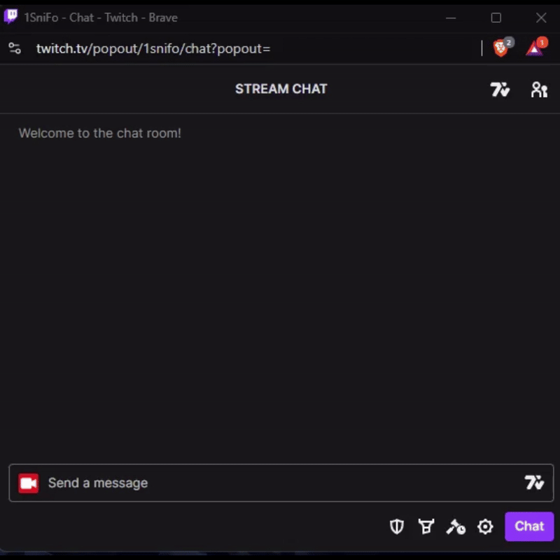
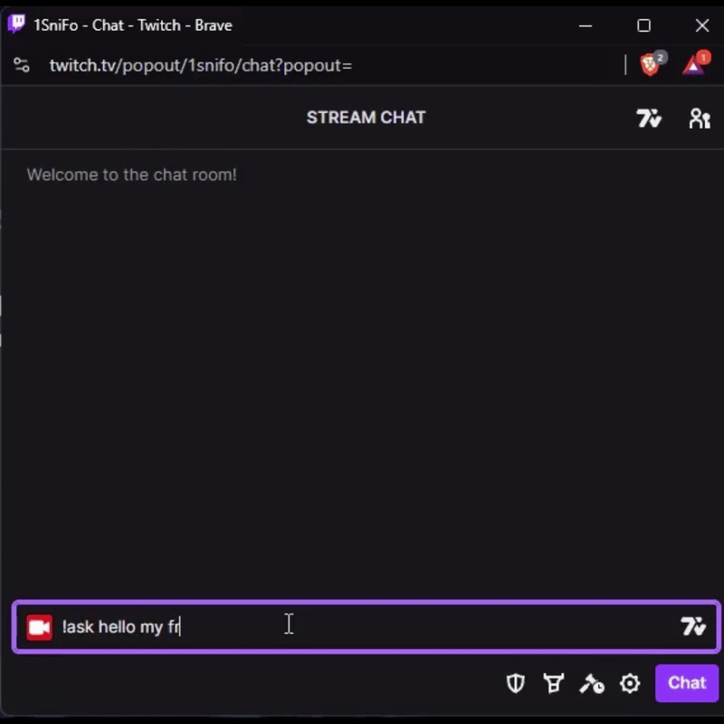

# TwitchAi

TwitchAi is an AI-powered Twitch bot that responds to events like follows, subscriptions, cheers, and more.

### Features
- **Real-Time Engagement**: Responds to Twitch events.
- **AI-Powered**: Generates witty chat messages.
- **Customizable**: Set up with your Twitch client ID and AI model.

### Examples

**Follow Example**  


**Subscription Example**  


### Setup

1. Clone the repo:

    ```bash
    git clone https://github.com/yourusername/TwitchAi.git
    cd TwitchAi
    ```

2. Install dependencies:

    ```bash
    pip install -r requirements.txt
    ```

3. Install **Lama** from [ollama.com/download](https://ollama.com/download).

4. Set up your `.env` file:

    ```
    CLIENT_ID=your-twitch-client-id
    AI_MODEL=your-ai-model-config
    ```

5. Run the bot:

    ```bash
    python launcher.py
    ```